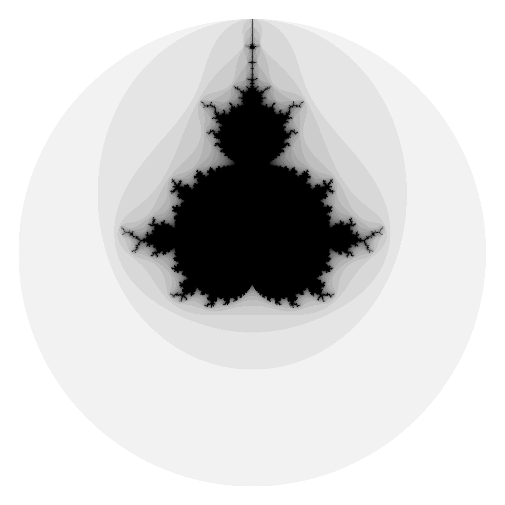
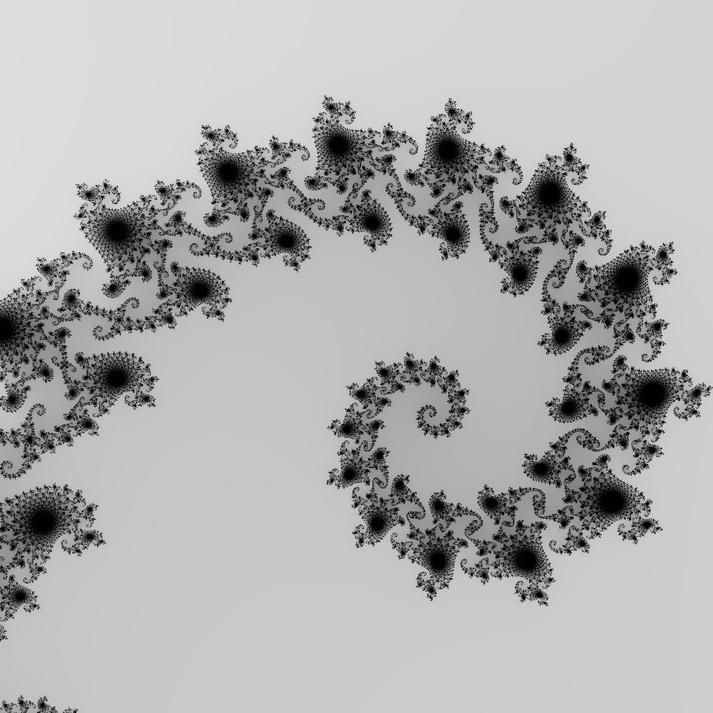
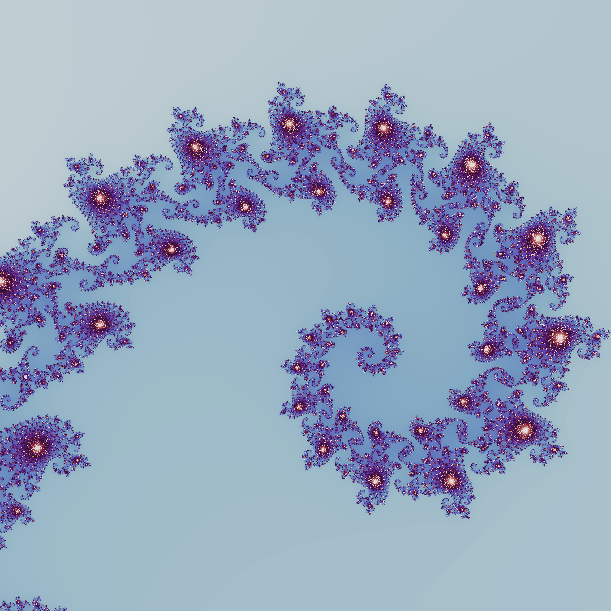

# Mandelbrot Sets

this class contains the minimal functions to create a Mandelbrot Set. It´s possible to plot this image with Pillow. The 
final produkt could look like this:

*this image is rotated to the right*

## at Misiurewicz Point

Guide can be found [here](https://realpython.com/mandelbrot-set-python/)
